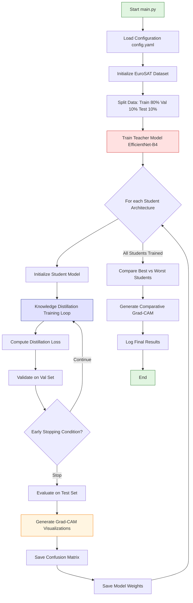

# 📖 CV_Project: Knowledge Distillation for Satellite Image Classification 


> A comprehensive Computer Vision university project implementing **teacher-student knowledge distillation** using PyTorch to compress large CNN models while maintaining high accuracy on the EuroSAT satellite image dataset.

## ✨ Features

This project demonstrates cutting-edge deep learning techniques for model compression and explainability through several key capabilities:

- **🎓 Knowledge Distillation Framework**: Transfer learning from a large EfficientNet-B4 teacher model to five lightweight student architectures
- **🏗️ Multiple Student Architectures**: 
  - SimpleNet (basic CNN)
  - StudentResNet (with residual blocks)
  - StudentNetSeparable (depthwise separable convolutions)
  - StudentNetDepthwiseSkip (skip connections)
  - StudentNetLight (ultra-lightweight)
- **🔍 Grad-CAM Visualization**: Visual explanation of model decisions through gradient-weighted class activation mapping
- **📊 Comprehensive Evaluation**: Automatic computation of accuracy, precision, recall, F1-score, confusion matrices, and efficiency metrics
- **⚡ Training Optimization**: Early stopping, learning rate scheduling, and validation-based model selection
- **⚙️ Hydra Configuration**: Flexible experiment management with reproducible hyperparameter settings

## 🚀 Installation

### Prerequisites

Ensure you have Python 3.8+ and CUDA-enabled GPU for optimal performance.

### Quick Setup

```bash
# Clone the repository
git clone https://github.com/NartoTeroKK/CV_project.git
cd CV_project

# Create a virtual environment (recommended)
python -m venv venv
source venv/bin/activate  # On Windows: venv\Scripts\activate

# Install dependencies
pip install -r requirements.txt
```

### Docker Setup (Alternative)

```dockerfile
# Dockerfile
FROM pytorch/pytorch:2.7.1-cuda12.6-cudnn9-runtime

WORKDIR /app
COPY requirements.txt .
RUN pip install -r requirements.txt

COPY . .
CMD ["python", "main.py"]
```

## 🛠️ Usage

### Basic Training

Run the complete training pipeline with default settings:

```bash
python main.py
```

### Custom Configuration

Modify training parameters in `config.yaml` or override via command line:

```bash
# Example: Change batch size and number of epochs
python main.py batch_size=128 s_epochs=30 t_epochs=10

# Example: Adjust distillation parameters
python main.py alpha=0.5 temperature=5.0 seed=42

# Example: Change data directory
python main.py data_dir="/path/to/your/data"
```

### Configuration Parameters

<details>
<summary>📋 Click to expand configuration options</summary>

| Parameter | Default | Description |
|-----------|---------|-------------|
| `t_epochs` | 5 | Teacher model training epochs |
| `s_epochs` | 20 | Student model training epochs |
| `data_dir` | "./data" | Dataset directory path |
| `batch_size` | 64 | Training batch size |
| `num_classes` | 10 | Number of classification classes |
| `alpha` | 0.7 | Distillation loss weight (0-1) |
| `temperature` | 3.0 | Softmax temperature for KD |
| `seed` | 47 | Random seed for reproducibility |

</details>

### Output Structure

After training, Hydra creates timestamped output directories:

```
outputs/YYYY-MM-DD/HH-MM-SS/
├── student_models/          # Trained model weights (.pth files)
├── gradcam_images/          # Grad-CAM visualizations per model
│   ├── SimpleNet/
│   ├── StudentResNet/
│   └── ...
├── confusion_matrices/      # Confusion matrix plots
└── main1.log               # Complete training log with metrics
```

## 📦 Technologies

### Core Dependencies

| Technology | Version | Purpose |
|------------|---------|---------|
| **PyTorch** | 2.7.1 | Deep learning framework |
| **torchvision** | 0.22.1 | Computer vision utilities |
| **torchmetrics** | 1.8.0 | Evaluation metrics |
| **Hydra** | 1.3.2 | Configuration management |
| **OpenCV** | 4.12.0 | Image processing |
| **Matplotlib** | 3.10.3 | Visualization |
| **Seaborn** | 0.13.2 | Statistical plotting |
| **NumPy** | 2.2.6 | Numerical computing |

### Hardware Acceleration

- **NVIDIA CUDA** 12.6 with cuDNN 9.5.1
- **Automatic mixed precision** support
- **Multi-GPU** training capability

## 🔧 Configuration

### Dataset Configuration

The project uses the **EuroSAT** satellite image dataset:

- **📸 Classes**: 10 land use categories (AnnualCrop, Forest, Highway, etc.)
- **🖼️ Image Size**: 64×64 pixels RGB
- **🎯 Split**: 80% training, 10% validation, 10% test
- **⚖️ Normalization**: ImageNet standard normalization

### Knowledge Distillation Setup

The distillation loss combines hard and soft targets:

```python
# Distillation loss formula
total_loss = α × soft_loss + (1 - α) × hard_loss

# Where:
# soft_loss = KL_Divergence(student_logits/T, teacher_logits/T)
# hard_loss = CrossEntropyLoss(student_logits, true_labels)
# α = 0.7 (weight for soft loss)
# T = 3.0 (temperature parameter)
```

### Learning Rate Scaling

Learning rate scales linearly with batch size:

```python
learning_rate = (0.001 / 32) × batch_size
# batch_size=32  → lr=0.001
# batch_size=64  → lr=0.002
# batch_size=128 → lr=0.004
```

## ✅ Requirements

### System Requirements

- **OS**: Linux, macOS, or Windows 10+
- **Python**: 3.8 or higher
- **GPU**: CUDA-capable with 8GB+ VRAM (recommended)
- **RAM**: 16GB+ system memory
- **Storage**: 10GB+ free disk space

### Python Environment

<details>
<summary>📦 Click to view complete requirements.txt</summary>

```txt
torch==2.7.1
torchvision==0.22.1
torchmetrics==1.8.0
hydra-core==1.3.2
omegaconf==2.3.0
matplotlib==3.10.3
seaborn==0.13.2
opencv-python==4.12.0.88
numpy==2.2.6
pandas==2.3.1
pillow==11.3.0
PyYAML==6.0.2
nvidia-cuda-runtime-cu12==12.6.77
nvidia-cudnn-cu12==9.5.1.17
```

</details>

## 🗂️ Repository Structure

```
CV_project/
├── 📁 models/
│   ├── 🏫 teachers.py          # Teacher architectures (EfficientNet-B4, ResNet variants)
│   └── 🎓 students.py          # Student architectures (5 lightweight variants)
├── 📁 utils/
│   ├── 📊 data_loaders.py      # EuroSAT dataset loading and preprocessing
│   ├── 🏋️ training.py          # Training loops for teacher and student models
│   ├── 📈 evaluation.py        # Model evaluation metrics and confusion matrices
│   └── 🔍 gradcam.py           # Grad-CAM implementation and visualization
├── 📁 conf/
│   └── ⚙️ config.yaml          # Hydra configuration file
├── 🚀 main.py                  # Main training script with orchestration logic
├── 📊 script_plot.py           # Plotting utilities for result visualization
├── 📋 requirements.txt         # Python dependencies
├── 📝 notes.txt               # Development notes and observations
├── 🚫 .gitignore              # Git ignore patterns
└── 📖 README.md               # This file
```

### 🔍 Key Components Detailed

#### **Model Architectures**

**🏫 Teacher Models (`teachers.py`)**
- **Teacher_efficientnet_b4**: Primary teacher using EfficientNet-B4 with ImageNet pretraining
- **Teacher_resnet18/50**: Alternative ResNet-based teachers
- **Teacher_wideresnet50_2**: Wide ResNet variant for comparison
- **Teacher_convnext_tiny**: Modern ConvNeXt architecture option

**🎓 Student Models (`students.py`)**
- **SimpleNet**: Basic 2-layer CNN (1.3M parameters)
- **StudentResNet**: Residual connections with batch normalization (169K parameters)
- **StudentNetSeparable**: Depthwise separable convolutions for efficiency (151K parameters)
- **StudentNetDepthwiseSkip**: Skip connections with depthwise convolutions (153K parameters)
- **StudentNetLight**: Ultra-lightweight design (8.4M parameters but simple architecture)

#### **Utility Modules**

**📊 Data Loading (`data_loaders.py`)**
- Automatic EuroSAT dataset download and preprocessing
- Train/validation/test splitting with class balance
- ImageNet normalization and data augmentation
- Weighted random sampling for class imbalance handling

**🏋️ Training (`training.py`)**
- Knowledge distillation loss implementation
- Early stopping with patience mechanism
- Learning rate scheduling (ReduceLROnPlateau)
- Validation-based model selection

**📈 Evaluation (`evaluation.py`)**
- Comprehensive metrics: accuracy, precision, recall, F1-score
- Efficiency metrics: parameters count, inference time
- Confusion matrix generation and visualization
- Model comparison utilities

**🔍 Explainability (`gradcam.py`)**
- Gradient-weighted Class Activation Mapping
- Layer-wise visualization for all student models
- Comparative analysis between best/worst performing students
- Automated saving of visualization outputs

## 🔗 Architecture Flow Chart



### 📊 Data Flow Process

<details>
<summary>🔄 Click to expand detailed workflow</summary>

1. **🎬 Initialization**: Configuration loading and dataset preparation with automatic EuroSAT download
2. **🏫 Teacher Training**: EfficientNet-B4 trained for 5 epochs with validation monitoring
3. **🎓 Student Distillation**: Each of 5 student architectures undergoes knowledge distillation training
4. **📉 Loss Computation**: Combined distillation loss using temperature-scaled softmax outputs
5. **📊 Evaluation**: Comprehensive metric computation including efficiency analysis
6. **🔍 Explainability**: Grad-CAM visualization generation for model interpretability
7. **🏆 Comparison**: Best vs. worst performing students analyzed using Grad-CAM
8. **📋 Output**: All results logged with Hydra's timestamped directory structure

</details>

## 🤝 Contributing

We welcome contributions! Please follow these guidelines:

### 🐛 Bug Reports
- Use the issue template
- Include system information
- Provide reproducible examples

### 🚀 Feature Requests
- Check existing issues first
- Provide clear use case description
- Consider implementation complexity

### 💻 Pull Requests
1. Fork the repository
2. Create a feature branch (`git checkout -b feature/amazing-feature`)
3. Commit changes (`git commit -m 'Add amazing feature'`)
4. Push to branch (`git push origin feature/amazing-feature`)
5. Open a Pull Request

### 📝 Code Style
- Follow PEP 8 guidelines
- Use type hints where possible
- Add docstrings for new functions
- Include unit tests for new features

## 📄 Documentation

### 📚 Additional Resources

- **📖 Research Paper**: [Knowledge Distillation (Hinton et al.)](https://arxiv.org/abs/1503.02531)
- **🔍 Grad-CAM**: [Visual Explanations from Deep Networks](https://arxiv.org/abs/1610.02391)
- **🛰️ EuroSAT Dataset**: [Land Use Classification Dataset](https://github.com/phelber/EuroSAT)

### 🎯 Usage Examples

<details>
<summary>💡 Click to view advanced usage examples</summary>

**Custom Teacher Model:**
```python
# Use different teacher architecture
python main.py teacher_model=resnet50

# Combine multiple teachers (ensemble)
python main.py use_ensemble=true
```

**Experiment Tracking:**
```python
# Run multiple seeds for statistical significance
for seed in [42, 123, 456, 789, 999]:
    python main.py seed=$seed
```

**Hyperparameter Sweep:**
```python
# Grid search over key parameters
python main.py --multirun alpha=0.3,0.5,0.7,0.9 temperature=1.0,3.0,5.0,10.0
```

</details>

## ❤️ Acknowledgements

This project was developed as part of a **Computer Vision** university course, exploring state-of-the-art knowledge distillation techniques for efficient deep learning model deployment.

### 🙏 Special Thanks

- **📊 Dataset**: EuroSAT satellite image dataset provided by torchvision.datasets
- **🛠️ Frameworks**: Built with PyTorch deep learning framework and Hydra configuration management
- **📖 Research**: Implementation based on knowledge distillation methodology from Hinton et al.
- **🔍 Explainability**: Grad-CAM implementation following Selvaraju et al.'s approach

### 🏆 Performance Highlights

From our experimental results:
- **🎯 Teacher Accuracy**: 96.63% on EuroSAT test set
- **🏅 Best Student**: StudentResNet achieved 88.33% accuracy with only 169K parameters
- **⚡ Efficiency**: 57× parameter reduction while retaining 91% of teacher performance
- **🔍 Interpretability**: Grad-CAM visualizations reveal learned spatial attention patterns

## 📝 Changelog

### 🔄 Development Summary

**🎯 Core Implementation**: Complete teacher-student framework with EfficientNet-B4 transferring knowledge to 5 lightweight architectures through temperature-scaled distillation loss.

**🏋️ Training Methodology**: Validation-based early stopping with patience, learning rate scheduling, and linear scaling based on batch size for optimal convergence.

**📊 Evaluation Framework**: Comprehensive metrics including classification performance, efficiency analysis, and explainability visualizations.

**📈 Experimental Results**: Demonstrated successful knowledge transfer with significant model compression while maintaining competitive accuracy across different student architectures.

### 🚀 Recent Updates

- ✅ Added support for multiple teacher architectures
- ✅ Implemented comprehensive logging with Hydra
- ✅ Enhanced Grad-CAM visualization with comparative analysis
- ✅ Optimized training pipeline with early stopping
- ✅ Added automated confusion matrix generation

---

<div align="center">

**🌟 Star this repository if you found it helpful! 🌟**

[](https://github.com/NartoTeroKK/CV_project)
[](https://github.com/NartoTeroKK/CV_project/fork)

*Made with ❤️ for the Computer Vision community*

</div>
